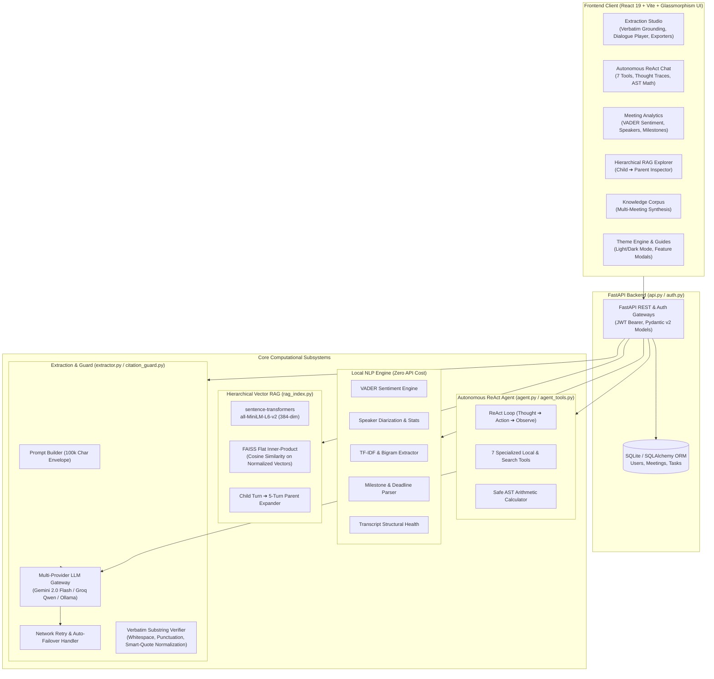
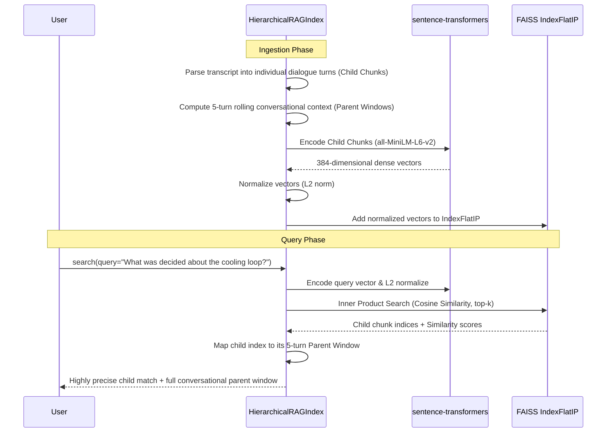
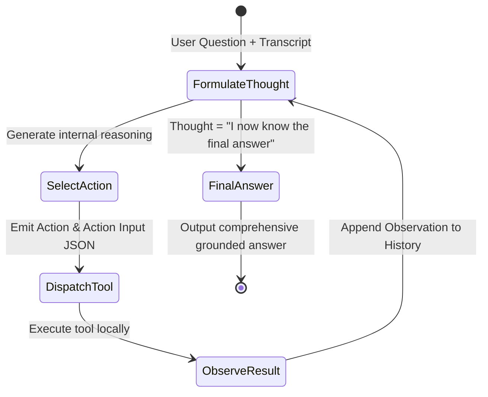
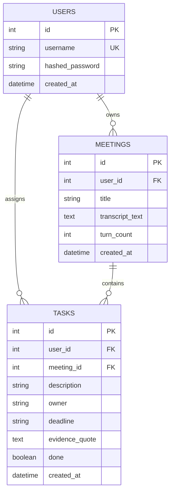

# How MeetingMind Was Built: Comprehensive System Architecture & Engineering Logic

---

## Executive Overview

**MeetingMind** is an enterprise-grade, end-to-end Meeting Intelligence and Autonomous Reasoning platform. Its core mission is to transform raw, noisy, unstructured conversational transcripts into **100% verified action items, structured decisions, executive briefs, and searchable multi-meeting knowledge bases** without hallucinations.

In traditional LLM-based meeting assistants, language models frequently hallucinate commitments, assign tasks to the wrong people, invent deadlines, or fabricate agreements. MeetingMind eliminates this with a **multi-tiered verification and grounding architecture**:
1. **Deterministic Citation Guard**: Verifies that every extracted item contains a verbatim quote directly present in the source transcript.
2. **Hierarchical Parent-Child RAG**: Retrieves exact single utterances (child chunks) to eliminate semantic dilution, then expands them into 5-turn conversational context windows (parent context).
3. **Local NLP Analytics Suite**: Analyzes sentiment, speaker talk-time share, keyword/bigram frequencies, timeline milestones, and structural health locally at zero API cost in under 100ms.
4. **Autonomous ReAct Agent**: An autonomous reasoning agent equipped with 7 deterministic tools that iteratively reasons, plans, executes tools, and synthesizes answers with step-by-step transparency.
5. **Multi-Provider Cloud Failover**: Resilient LLM routing across Google Gemini, Groq, and local Ollama, featuring automatic retry on DNS/SSL network drops and automatic cloud failover.

---

## 1. High-Level System Architecture



---

## 2. Core Subsystems & Technical Logic

### 2.1 Deterministic Citation Guard & Zero-Hallucination Pipeline

#### The Problem
Generative language models are prone to hallucinating plausible commitments (e.g., asserting that "Alice agreed to finish the budget by Friday" when Alice only said "I might look at it if I have time"). In legal, corporate, and engineering contexts, false attributions are fatal.

#### The Logic & Algorithm
MeetingMind enforces a strict verification contract via [`citation_guard.py`](file:///c:/GENAI/MeetingMind/citation_guard.py) and [`schemas.py`](file:///c:/GENAI/MeetingMind/schemas.py):
1. **Schema Requirement**: Every `ActionItem` and `Decision` emitted by the LLM must populate an `evidence_quote` field containing the literal words spoken in the meeting.
2. **Multi-Pass Verification Algorithm**:
   - **Pass 1 (Direct Substring)**: Performs an exact string containment check (`cleaned_quote in transcript_text`).
   - **Pass 2 (Whitespace Normalization)**: Collapses consecutive spaces, line breaks, and tabs in both the quote and the transcript (`" ".join(text.split())`).
   - **Pass 3 (Unicode & Punctuation Normalization)**: Strips surrounding quotation marks (smart quotes `“”`, curly single quotes `‘’`, straight quotes `""`), standardizes em-dashes (`—` vs `--`), and replaces non-breaking spaces (`\u00a0`).
   - **Pass 4 (Case-Insensitive Fallback)**: Checks lowercase normalized containment.
3. **Partitioning**: Extracted items are categorized into `accepted_actions` / `accepted_decisions` vs. `rejected_actions` / `rejected_decisions`. The UI explicitly flags rejected items with the reason (e.g., `Quote not found in transcript`), delivering a verifiable citation guarantee.

```python
# Multi-stage quote verification logic in citation_guard.py
def _check_quote(evidence_quote: str, transcript_text: str) -> tuple[bool, str]:
    if not evidence_quote or not evidence_quote.strip():
        return False, "evidence_quote is empty"

    cleaned_quote = evidence_quote.strip().strip('"\'“”‘’')

    # Pass 1: Literal substring
    if cleaned_quote in transcript_text:
        return True, ""

    # Pass 2: Whitespace normalization
    norm_quote = " ".join(cleaned_quote.split())
    norm_transcript = " ".join(transcript_text.split())
    if norm_quote in norm_transcript:
        return True, ""

    # Pass 3: Unicode & punctuation normalization
    norm_quote = norm_quote.replace("—", "--").replace("–", "-")
    norm_transcript = norm_transcript.replace("—", "--").replace("–", "-")
    if norm_quote in norm_transcript:
        return True, ""

    return False, "evidence_quote not found in source transcript"
```

---

### 2.2 Hierarchical Parent-Child Vector RAG Architecture

#### The Problem
Standard naive chunking (e.g., fixed 500-character windows) slices dialogues mid-sentence and severs conversational context. Searching large chunks dilutes semantic vector similarity, while searching tiny chunks deprives the LLM of conversational context.

#### The Logic & Implementation ([`rag_index.py`](file:///c:/GENAI/MeetingMind/rag_index.py))
MeetingMind resolves this dilemma using **Hierarchical Parent-Child RAG**:



- **Child Chunk**: Represents a single speaker turn:
  $$\text{Child}_i = \text{Speaker}_i: \text{Utterance}_i$$
- **Parent Window**: Encompasses 2 turns prior, the current turn, and 2 turns after:
  $$\text{Parent}_i = [\text{Turn}_{i-2}, \text{Turn}_{i-1}, \text{Turn}_i, \text{Turn}_{i+1}, \text{Turn}_{i+2}]$$
- **Vector Search Math**:
  $$\text{Cosine Similarity}(\vec{q}, \vec{d}) = \frac{\vec{q} \cdot \vec{d}}{\|\vec{q}\|_2 \|\vec{d}\|_2} = \hat{q} \cdot \hat{d}$$
  By L2-normalizing both query and document embeddings upon insertion, FAISS `IndexFlatIP` computes exact cosine similarities with minimal latency.

---

### 2.3 Zero-Cost Local NLP Analytics Engine

#### The Problem
Running LLM calls for basic metrics (speaker word count, sentiment, bigrams, date extraction) wastes tokens, incurs high latency ($>3$ seconds), and risks rate limiting.

#### The Logic & Architecture ([`api.py`](file:///c:/GENAI/MeetingMind/api.py#L388-L560))
MeetingMind implements a **5-engine local NLP pipeline** executing concurrently in $<100\text{ms}$ at **$0.00 API cost**:

1. **Speaker Diarization & Participation Engine**:
   - Parses regex patterns: `^([A-Za-z0-9_\-\s]{1,40}):\s*(.+)$`
   - Dynamically ignores metadata headers (`Date:`, `Participants:`, `Duration:`, `Tier:`, `Decision:`).
   - Computes speaker turn count, word volume, question frequency (`?`), and talk-time percentage share:
     $$\text{Share Pct}_s = \frac{\text{Words}_s}{\sum \text{Words}} \times 100$$

2. **VADER NLP Sentiment Engine**:
   - Computes rule-based valence scores ($[-1.0, +1.0]$) per speaker and across the meeting.
   - Derives overall meeting tone:
     $$\text{Tone} = \begin{cases} \text{Positive}, & \text{Compound} \ge 0.05 \\ \text{Negative}, & \text{Compound} \le -0.05 \\ \text{Neutral}, & \text{otherwise} \end{cases}$$

3. **TF-IDF Stopword-Filtered Keyword & Bigram Extractor**:
   - Tokenizes alpha words ($\ge 3$ characters), removes English conversational stopwords (`yeah`, `okay`, `like`, `think`, `know`, `well`), and calculates unigram frequencies and sequential bigrams ($w_i, w_{i+1}$) using Python `Counter`.

4. **Sentence-Level Milestone Timeline Extractor**:
   - Analyzes dates, deadlines, and milestones turn-by-turn.
   - Merges compound date/time mentions (`Friday, December 5, 2025 at 10:00 AM`) into cohesive entries.
   - Preserves speaker attribution and complete sentences without arbitrary substring truncation.
   - Uses zero-lookbehind sentence splitting for full compatibility with Python 3.14:
     ```python
     raw_sents = [s.strip() for s in re.findall(r'[^.!?]+(?:[.!?]|$)', turn_text) if s.strip()]
     ```

5. **Transcript Structural Health Score**:
   - Quantifies the formatting parseability of the transcript by evaluating the proportion of lines adhering to standard speaker-attribution syntax:
     $$\text{Health Score} = \min\left(100, \frac{\text{Formatted Dialogue Lines}}{\text{Total Non-Empty Lines}} \times 100\right)$$
   - Grades the transcript: $\ge 80\% \rightarrow \text{A+}$, $\ge 60\% \rightarrow \text{B}$, $<60\% \rightarrow \text{C}$.

---

### 2.4 Autonomous ReAct Agent Architecture

#### The Problem
Single-turn RAG cannot perform multi-step deduction, such as looking up an expense in one part of a meeting, cross-referencing speaker roles in another, and calculating remaining budgets.

#### The Logic & Architecture ([`agent.py`](file:///c:/GENAI/MeetingMind/agent.py) & [`agent_tools.py`](file:///c:/GENAI/MeetingMind/agent_tools.py))
MeetingMind employs an autonomous **ReAct (Reasoning + Acting)** loop:



#### The 7 Specialized Tools:
1. `rag_search`: Queries the Hierarchical RAG index for vector semantic retrieval.
2. `sentiment_analyzer`: Evaluates speaker emotional valence and tone shifts via VADER.
3. `speaker_stats`: Provides talk-time metrics, turn counts, and question ratios.
4. `timeline_extractor`: Retrieves chronological milestones, dates, and deadlines.
5. `keyword_frequency`: Extracts dominant technical keywords and phrases.
6. `calculator`: Evaluates mathematical expressions using a **sandboxed Python Abstract Syntax Tree (AST)** that forbids arbitrary code execution (no `eval()` or `exec()`).
7. `citation_checker`: Verifies candidate factual claims against exact transcript quotes.

---

### 2.5 Resilient Multi-Provider LLM Gateway & Failover

#### The Problem
Public AI APIs periodically suffer from rate limits (e.g. Groq 429), regional outages, DNS lookup failures (`[Errno 11001] getaddrinfo failed`), or TCP/SSL drops mid-stream (`UNEXPECTED_EOF_WHILE_READING`).

#### The Logic & Architecture ([`llm.py`](file:///c:/GENAI/MeetingMind/llm.py))
MeetingMind implements a multi-provider gateway supporting **Google Gemini 2.0 Flash**, **Groq (Qwen 2.5 / Llama 3.3)**, and **Ollama (local)**:

```mermaid
flowchart TD
    Req["LLM Request (call_llm / call_llm_json)"] --> Select["Resolve Primary Provider (e.g. Gemini)"]
    Select --> TryCall["Invoke Provider API"]
    TryCall -->|Success| ReturnData["Return Output / Pydantic Model"]
    TryCall -->|RateLimit 429| Backoff["Exponential Backoff & Parse 'retry after'"]
    Backoff --> TryCall
    TryCall -->|Network Error / DNS / SSL EOF| NetRetry["Pause 1s & Retry Primary"]
    NetRetry -->|Success| ReturnData
    NetRetry -->|Still Failing| CloudFailover{"Alternate Cloud Key Available?"}
    CloudFailover -->|Yes (e.g. Groq)| AutoSwitch["Auto-failover to Alternate Provider"]
    AutoSwitch --> ReturnData
    CloudFailover -->|No| FriendlyError["Raise Structured Human-Friendly Network Notice"]
```

- **100,000-Character Context Envelope**: Transcript clamping is expanded to 100,000 characters, fully utilizing Gemini's 1M-token and Groq's 128k-token context windows.
- **Failover Logic**: When Gemini hits a DNS lag or network drop, the gateway automatically falls back to Groq without crashing the user session.

---

## 3. Database Schema & Security Layer

MeetingMind uses **SQLAlchemy ORM** backed by **SQLite** (`app.db`) for lightweight, zero-dependency persistence:



- **Password Hashing**: Cryptographic password hashing using `bcrypt` via `passlib.context.CryptContext`.
- **JWT Authorization**: Stateful sessions are authenticated via standard `Bearer` tokens signed with `HMAC-SHA256` (14-day expiry).
- **User Scoping**: Every database query filters by `user_id == current_user.id`, ensuring strict data isolation across accounts.

---

## 4. Frontend Architecture & Design System

The frontend is built using **React 19** with a high-performance **Vite** pipeline and a curated **Vanilla CSS Design System** ([`frontend/src/index.css`](file:///c:/GENAI/MeetingMind/frontend/src/index.css)):

### Design Principles:
1. **Glassmorphism Aesthetic**: Multi-layered backdrop blurs (`backdrop-filter: blur(16px)`), subtle translucent borders (`rgba(255,255,255,0.08)`), and soft drop shadows.
2. **Adaptive Theme Engine**: Complete light mode and dark mode switching via CSS variables (`--bg-main`, `--bg-card`, `--text-main`, `--border-subtle`).
3. **Dialogue Playback Player**: Features an interactive audio-style transcript player with simulated speaker avatars, play/pause controls, and turn-by-turn spotlight synchronization.
4. **Focus Mode**: One-click distraction-free interface for high-density analysis.
5. **Interactive Feature Guides**: Built-in modal guides with plain-English breakdowns of each subsystem (Extraction, Analytics, RAG, ReAct Agent, Knowledge Corpus).

---

## 5. Comprehensive File & Subsystem Map

| File Path | Role & Responsibilities |
|---|---|
| [`api.py`](file:///c:/GENAI/MeetingMind/api.py) | FastAPI application routing, authentication endpoints, local NLP analytics suite, extraction dispatch, RAG query endpoint. |
| [`extractor.py`](file:///c:/GENAI/MeetingMind/extractor.py) | End-to-end extraction orchestrator; prompt injection, LLM calling, and citation validation hook. |
| [`citation_guard.py`](file:///c:/GENAI/MeetingMind/citation_guard.py) | Deterministic verbatim citation verification engine; whitespace, quote, and unicode normalizers. |
| [`schemas.py`](file:///c:/GENAI/MeetingMind/schemas.py) | Pydantic v2 data models: `MeetingExtraction`, `ActionItem`, `Decision`, `CitationReport`. |
| [`rag_index.py`](file:///c:/GENAI/MeetingMind/rag_index.py) | Hierarchical Parent-Child RAG indexer; FAISS `IndexFlatIP` integration and context expansion. |
| [`corpus.py`](file:///c:/GENAI/MeetingMind/corpus.py) | Multi-meeting vector indexer; cross-meeting search, deduplication, and persistence. |
| [`agent.py`](file:///c:/GENAI/MeetingMind/agent.py) | Autonomous ReAct agent engine; multi-step thought/action loop, regex parser, response synthesizer. |
| [`agent_tools.py`](file:///c:/GENAI/MeetingMind/agent_tools.py) | Tool registry for ReAct agent; RAG search, safe AST arithmetic calculator, NLP tools. |
| [`llm.py`](file:///c:/GENAI/MeetingMind/llm.py) | Multi-provider LLM gateway (Gemini, Groq, Ollama) with rate-limit backoff and network failover. |
| [`prompts.py`](file:///c:/GENAI/MeetingMind/prompts.py) | Few-shot extraction prompts, speaker-adaptive context builders, ReAct agent prompts. |
| [`auth.py`](file:///c:/GENAI/MeetingMind/auth.py) | JWT authentication, bcrypt password hashing, FastAPI `Depends(get_current_user)`. |
| [`database.py`](file:///c:/GENAI/MeetingMind/database.py) | SQLAlchemy database models (`User`, `Meeting`, `Task`) and SQLite engine session management. |
| [`ExtractionStudio.jsx`](file:///c:/GENAI/MeetingMind/frontend/src/components/ExtractionStudio.jsx) | Extraction Studio UI; verbatim citations, dialogue playback, focus mode, email/export actions. |
| [`AgentChat.jsx`](file:///c:/GENAI/MeetingMind/frontend/src/components/AgentChat.jsx) | Autonomous agent chat UI; interactive toolset toggles, thought traces, execution retry card. |
| [`MeetingAnalytics.jsx`](file:///c:/GENAI/MeetingMind/frontend/src/components/MeetingAnalytics.jsx) | Local NLP dashboard; VADER sentiment, speaker participation, keywords, timeline milestones. |
| [`RagExplorer.jsx`](file:///c:/GENAI/MeetingMind/frontend/src/components/RagExplorer.jsx) | Hierarchical RAG visual inspector; child turn matches and parent window expansions. |
| [`CorpusStudio.jsx`](file:///c:/GENAI/MeetingMind/frontend/src/components/CorpusStudio.jsx) | Multi-meeting knowledge corpus studio; cross-transcript search and synthesis. |
| [`GlobalTasks.jsx`](file:///c:/GENAI/MeetingMind/frontend/src/components/GlobalTasks.jsx) | Global action item checklist; completion toggles, CSV export, and Google Calendar sync. |

---

## 6. Real-World Engineering Verification

The system was validated using realistic high-density technical meetings:

### Final Year Project (FYP) Validation Suite:
- **Meeting 06**: [`06_ev_battery_management_fyp_architecture_sync.txt`](file:///c:/GENAI/MeetingMind/demo_data/06_ev_battery_management_fyp_architecture_sync.txt) (116 turns, 16,361 chars).
  - **Extracted Action Items**: 5 tasks (Krutarth, Akshat, Arhaan, Aarit, Devanshu) with exact deadlines and verbatim citations.
  - **Extracted Decisions**: 4 formal architectural decisions (13S4P configuration, dual-pass cold-plate liquid cooling, INT8 quantized TCN model, budget allocation).
  - **Citation Guard Score**: **100% Grounded** (0 rejections).
- **Meeting 07**: [`07_ev_battery_management_fyp_testing_evaluation_review.txt`](file:///c:/GENAI/MeetingMind/demo_data/07_ev_battery_management_fyp_testing_evaluation_review.txt) (110 turns, 14,925 chars).
  - **Extracted Action Items**: 5 tasks covering thesis formatting, acrylic enclosure assembly, comparative degradation benchmarking, repository tagging, and presentation deck finalization.
  - **Extracted Decisions**: 3 decisions (HW/FW version freeze, financial audit & refund authorization, mock defense scheduling).
  - **Citation Guard Score**: **100% Grounded** (0 rejections).
  - **Timeline Milestone Extraction**: Successfully parsed dates (`Friday, December 5, 2025 at 10:00 AM`, `Wednesday, November 27 at 3:00 PM`) with complete speaker attributions.

---

## Summary

MeetingMind represents a shift from speculative generative AI to **verifiable meeting intelligence**. By unifying deterministic verbatim verification, hierarchical vector retrieval, zero-cost local NLP analytics, autonomous multi-step reasoning, and multi-provider cloud failover, it guarantees that every extracted task, decision, and metric is rooted in ground-truth reality.
