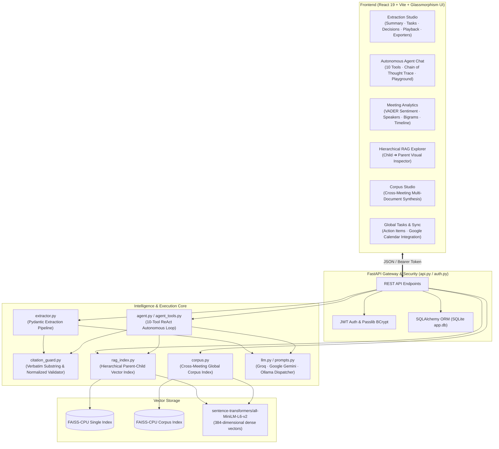

# MeetingMind 🧠 — Intelligent Meeting Intelligence & Verification Engine

[](https://www.python.org/downloads/)
[](https://react.dev/)
[](https://fastapi.tiangolo.com/)
[](https://github.com/facebookresearch/faiss)
[](https://docs.pydantic.dev/)
[](https://groq.com/)
[](https://opensource.org/licenses/MIT)

**MeetingMind** is an enterprise-grade, full-stack Generative AI meeting assistant and intelligence platform. It converts raw, unstructured meeting transcripts into verified action items, structured decisions, executive summaries, and multi-meeting knowledge bases with a **0% hallucination guarantee** via deterministic verbatim citation grounding.

---

## 📑 Table of Contents

1. [Executive Summary & Value Proposition](#-executive-summary--value-proposition)
2. [High-Level System Architecture](#-high-level-system-architecture)
3. [Core Technical Subsystems](#-core-technical-subsystems)
   - [Deterministic Citation Guard (Zero Hallucinations)](#1-deterministic-citation-guard-zero-hallucinations)
   - [Dual RAG Architecture (Single-Meeting vs Cross-Meeting)](#2-dual-rag-architecture-single-meeting-vs-cross-meeting)
   - [10-Tool ReAct Autonomous Agent](#3-10-tool-react-autonomous-agent)
   - [Zero-Cost Local NLP Analytics Engine](#4-zero-cost-local-nlp-analytics-engine)
   - [Multi-Provider LLM Engine & Structured Output](#5-multi-provider-llm-engine--structured-output)
4. [Codebase Map & Directory Structure](#-codebase-map--directory-structure)
5. [Data Models & Schema Reference](#-data-models--schema-reference)
6. [REST API Specification](#-rest-api-specification)
7. [CLI Reference](#-cli-reference)
8. [Frontend Workspace Modules](#-frontend-workspace-modules)
9. [Installation & Setup](#-installation--setup)
10. [Evaluation & Benchmarking](#-evaluation--benchmarking)

---

## 💡 Executive Summary & Value Proposition

Traditional LLM summarization often suffers from subtle hallucinations—inventing commitments, misattributing owners, or fabricating deadlines. MeetingMind solves this with a **deterministic verification loop**:

- **Verbatim Citation Grounding**: Every extracted action item and decision must cite an exact evidence quote from the dialogue. The Citation Guard verifies these spans against the source text before presenting them to the user.
- **Hierarchical Parent-Child RAG**: Retrieves granular single-utterance speaker turns (child chunks) to maximize vector precision, and expands them to 5-turn sliding windows (parent context) for LLM generation.
- **Multi-Meeting Cross-Corpus Synthesis**: Aggregates archives of past meetings into a persistent multi-document vector index for cross-meeting query synthesis.
- **Autonomous ReAct Agent Studio**: 10 deterministic and search tools orchestrated via a ReAct loop with step-by-step reasoning transparency.
- **Zero-Cost Instant Analytics**: Computes speaker diarization, participation share, VADER sentiment, timeline extraction, and term frequencies in $<500\text{ms}$ locally without LLM token costs.

---

## 🏗️ High-Level System Architecture



---

## ⚙️ Core Technical Subsystems

### 1. Deterministic Citation Guard (Zero Hallucinations)
- **File**: `citation_guard.py`
- **Core Function**: `validate_citations(transcript_text, extraction)`
- **Mechanism**:
  1. For each `ActionItem` and `Decision`, takes `evidence_quote`.
  2. Runs 4-tier match strategy:
     - Direct substring search (`quote in transcript`).
     - Whitespace-normalized match (collapsing repeated whitespace/tabs).
     - Unicode punctuation normalization (quotes, em-dashes, non-breaking spaces).
     - Case-insensitive token boundary match.
  3. Partitions items into `accepted_actions` / `rejected_actions` and `accepted_decisions` / `rejected_decisions`.
  4. Returns `CitationReport` with overall `rejection_rate` ($0.0 \to 1.0$).

---

### 2. Dual RAG Architecture (Single-Meeting vs Cross-Meeting)

MeetingMind employs two complementary RAG engines tailored for different analytical scopes:

```
┌───────────────────────────────────────────────────────────────────────────────┐
│                           DUAL RAG ARCHITECTURE                                │
├──────────────────────────────────────┬────────────────────────────────────────┤
│ 1. Intra-Meeting RAG (rag_index.py)  │ 2. Inter-Meeting Corpus (corpus.py)    │
├──────────────────────────────────────┼────────────────────────────────────────┤
│ • Scope: Single Transcript           │ • Scope: 10s–100s of Meeting Archives  │
│ • Unit: Speaker Turns (~1-2 lines)   │ • Unit: Multi-Meeting Sliding Windows  │
│ • Embedding: Child turns (all-MiniLM)│ • Tagging: meeting_id & source_name    │
│ • Context: 5-turn parent expansion   │ • Query: Multi-document synthesis      │
│ • Purpose: Exact dialogue resolution │ • Purpose: Cross-meeting trends/topics │
└──────────────────────────────────────┴────────────────────────────────────────┘
```

#### A. Single-Meeting Hierarchical Parent-Child RAG (`rag_index.py`)
- **Child Chunks**: Individual speaker turns (`Speaker: utterance`). High semantic resolution.
- **Parent Windows**: 5-turn sliding window centered around the child.
- **Retrieval**: User query matches child vectors in FAISS (`IndexFlatIP`). Matched indices expand to parent windows and deduplicate overlapping turns.

#### B. Cross-Meeting Multi-Document Corpus RAG (`corpus.py`)
- **Corpus Indexing**: Iterates over saved meetings, builds parent windows tagged with `{meeting_id, source_name}`.
- **Cross-Meeting Synthesis (`corpus_ask`)**: Retrieves top-$k$ relevant windows across all archived meetings and generates a unified response citing specific meetings by name.

---

### 3. 10-Tool ReAct Autonomous Agent
- **Files**: `agent.py`, `agent_tools.py`
- **Loop**: Thought $\to$ Action $\to$ Action Input $\to$ Observation $\to$ Final Answer (Max 10 steps).
- **Tool Suite**:

| Tool Name | Engine / Library | Purpose |
| :--- | :--- | :--- |
| `rag_search` | `HierarchicalRAGIndex` + FAISS | Semantically retrieves dialogue excerpts with parent context |
| `get_extraction` | `extractor.py` + `citation_guard.py` | Extracts verified actions, decisions, and citation report |
| `get_summary` | LLM Dispatcher | Generates an executive 2–3 sentence meeting overview |
| `calculator` | Safe Python AST evaluator | Evaluates mathematical expressions (budgets, percentages) |
| `web_search` | `duckduckgo-search` (`ddgs`) | Searches live internet for companies, terms, and context |
| `sentiment_analyzer` | `vaderSentiment` | Computes per-speaker and overall compound sentiment scores |
| `speaker_stats` | Zero-LLM Token Diarizer | Computes talk-time share, word counts, and question metrics |
| `timeline_extractor` | Date & Deadline Regex NLP | Builds chronological sequence of dates and milestones |
| `keyword_frequency` | Stopword-filtered TF & Bigrams | Identifies top technical terms and recurring bigrams |
| `citation_checker` | `citation_guard.py` | Verifies whether a specific claim or quote is grounded in text |

---

### 4. Zero-Cost Local NLP Analytics Engine
- **Files**: `api.py` (`/api/analyze`), `agent_tools.py`
- **Execution Time**: $<500\text{ms}$ on standard CPU.
- **Components**:
  1. **Speaker Diarization**: Computes word counts, utterance counts, talk-time share %, and questions asked per participant.
  2. **VADER Sentiment**: Classifies participant tone as Positive, Neutral, or Negative with compound scores ($-1.0 \to +1.0$).
  3. **Keyword Frequency & Bigrams**: Extracts unigrams and 2-word collocations excluding standard English stopwords.
  4. **Chronological Timeline**: Parses dates, days, deadlines (e.g., "by Friday", "Q3", "end of month") mapped to speakers.
  5. **Structural Citation Health**: Computes utterance density, turn frequency, and quotation verifiability.

---

### 5. Multi-Provider LLM Engine & Structured Output
- **Files**: `llm.py`, `prompts.py`
- **Providers Supported**:
  - **Groq** (Default: `groq/compound-mini`, `llama-3.3-70b-versatile`, `mixtral-8x7b-32768`)
  - **Google Gemini** (`gemini-2.0-flash`, `gemini-2.5-flash`, `gemini-1.5-pro` via `google-genai` SDK)
  - **Ollama** (Local self-hosted models: `llama3`, `mistral`)
- **JSON Reliability**: Enforces native JSON mode with structured schema prompting, markdown stripping, and automated 1-retry fallback.

---

## 📂 Codebase Map & Directory Structure

```
MeetingMind/
│
├── api.py                    # FastAPI application, auth endpoints, CRUD, and RAG/Agent routes
├── auth.py                   # JWT HS256 auth, password hashing (bcrypt), and current user dependency
├── database.py               # SQLite database connection and session maker (app.db)
├── models.py                 # SQLAlchemy ORM models (User, Meeting, Task)
├── schemas.py                # Pydantic v2 schemas (ActionItem, Decision, MeetingExtraction, etc.)
│
├── extractor.py              # LLM extraction pipeline with schema validation and citation checking
├── citation_guard.py         # Deterministic verbatim substring & normalized quote verification
├── prompts.py                # System prompts for extraction, summary, and cross-meeting synthesis
├── llm.py                    # Multi-provider LLM dispatch (Groq, Gemini, Ollama) with JSON mode
│
├── rag_index.py              # Hierarchical Parent-Child RAG with SentenceTransformers + FAISS
├── corpus.py                 # Cross-meeting multi-document vector index and synthesis engine
│
├── agent.py                  # ReAct autonomous agent execution loop with step tracking
├── agent_tools.py            # 10 deterministic & search tools for the ReAct agent
│
├── cli.py                    # Command-line interface for extraction, search, evaluation, and corpus
├── ami_loader.py             # HuggingFace AMI meeting corpus loader for benchmarking
├── eval.py                   # ROUGE-1/2/L and token latency evaluation harness
├── sanity_check.py           # Pre-flight environment diagnostics script
│
├── requirements.txt          # Python backend dependencies
├── .env.example              # Environment variables template
├── .env                      # Local environment configuration (API keys, models, secrets)
│
├── demo_data/                # Enterprise sample transcripts for testing and evaluation
│   ├── 01_cloud_architecture_migration_sync.txt
│   ├── 02_q3_enterprise_saas_product_strategy.txt
│   ├── 03_security_soc2_compliance_audit_review.txt
│   ├── 04_fintech_payment_gateway_incident_postmortem.txt
│   └── 05_ai_copilot_engineering_roadmap_sync.txt
│
├── examples/                 # Classic benchmark transcripts (e.g. dunder-mifflin-sales.txt)
│
└── frontend/                 # React 19 + Vite Frontend SPA
    ├── package.json          # Frontend dependencies (React 19, Lucide React, Vite)
    ├── vite.config.js        # Vite configuration with API reverse proxy
    └── src/
        ├── App.jsx           # Root application component and tab coordinator
        ├── index.css         # Glassmorphism design system, dark palette, responsive utilities
        ├── context/
        │   └── AuthContext.jsx # Authentication state and Bearer token wrapper (authFetch)
        └── components/
            ├── Header.jsx           # Application header with LLM provider selector & user profile
            ├── Navigation.jsx       # Primary navigation bar (Extraction, Intelligence, Tasks)
            ├── ExtractionStudio.jsx # Extraction dashboard, dialogue player, and email/Jira exporters
            ├── QueryHub.jsx         # Sub-tab switcher for Intelligence Hub
            ├── MeetingAnalytics.jsx # Local NLP analytics dashboard (Sentiment, Speakers, Bigrams)
            ├── AgentChat.jsx        # ReAct Autonomous Agent studio with tool controls & thought trace
            ├── RagExplorer.jsx      # Interactive Hierarchical RAG visual inspector
            ├── CorpusStudio.jsx     # Cross-Meeting multi-transcript knowledge synthesizer
            ├── GlobalTasks.jsx      # Action item checklist & Google Calendar integration
            └── AuthScreen.jsx       # Glassmorphism login & registration modal
```

---

## 📊 Data Models & Schema Reference

### Pydantic Extraction Schemas (`schemas.py`)

```python
class ActionItem(BaseModel):
    description: str = Field(description="Clear, actionable task description")
    owner: str = Field(default="Unassigned", description="Person responsible")
    deadline: str | None = Field(default=None, description="Explicit deadline, or null")
    evidence_quote: str = Field(description="Exact verbatim quote from transcript")

class Decision(BaseModel):
    description: str = Field(description="What was decided")
    evidence_quote: str = Field(description="Exact verbatim quote from transcript")

class MeetingExtraction(BaseModel):
    summary: str = Field(description="2-3 sentence executive summary")
    action_items: list[ActionItem] = Field(default_factory=list)
    decisions: list[Decision] = Field(default_factory=list)
```

### SQLAlchemy Database Models (`models.py`)

- **`User`**: `id`, `username`, `hashed_password`, `created_at`
- **`Meeting`**: `id`, `user_id`, `title`, `transcript_text`, `created_at`
- **`Task`**: `id`, `user_id`, `meeting_id`, `description`, `owner`, `deadline`, `evidence_quote`, `done`, `created_at`

---

## 🔌 REST API Specification

All routes under `/api/*` accept and return JSON. Authenticated endpoints require `Authorization: Bearer <token>`.

| Method | Endpoint | Auth | Description |
| :--- | :--- | :---: | :--- |
| `GET` | `/api/status` | No | System health, active LLM model, FAISS vector status |
| `POST` | `/api/auth/register` | No | Register new user account |
| `POST` | `/api/auth/login` | No | Authenticate user and receive JWT token |
| `GET` | `/api/meetings` | **Yes** | List all archived meetings for current user |
| `POST` | `/api/meetings` | **Yes** | Create and persist a new meeting transcript |
| `DELETE`| `/api/meetings/{id}` | **Yes** | Delete meeting and associated tasks |
| `POST` | `/api/extract` | **Yes** | Run LLM extraction + Citation Guard verification |
| `POST` | `/api/analyze` | **Yes** | Run zero-cost local NLP analytics (Sentiment, Speakers, Timeline) |
| `POST` | `/api/search` | **Yes** | Hierarchical RAG vector search (Child $\to$ Parent) |
| `POST` | `/api/ask` | **Yes** | Execute ReAct Autonomous Agent multi-step reasoning |
| `POST` | `/api/corpus/search` | **Yes** | Search across all/selected indexed meeting archives |
| `POST` | `/api/corpus/ask` | **Yes** | Ask a natural language question across the entire meeting corpus |
| `GET` | `/api/tasks` | **Yes** | Fetch persistent action items for user |
| `POST` | `/api/tasks` | **Yes** | Save action items to task list |
| `PUT` | `/api/tasks/{id}/toggle` | **Yes** | Toggle action item completion status (`done`) |

---

## 💻 CLI Reference

MeetingMind provides a command-line interface via `cli.py`:

```bash
# 1. Extract action items, decisions, and summary with citation verification
python cli.py extract examples/dunder-mifflin-sales.txt --provider groq

# 2. Hierarchical RAG search over a single transcript
python cli.py search examples/dunder-mifflin-sales.txt "who owns client relationships?" -k 3

# 3. Ask a question via the ReAct Autonomous Agent
python cli.py ask examples/dunder-mifflin-sales.txt "What did Pam agree to do and when?"

# 4. Build a persistent cross-meeting corpus from a directory of transcripts
python cli.py corpus-build demo_data/ --out corpus/

# 5. Ask a question across the entire indexed corpus
python cli.py corpus-ask "What are all the budget decisions across all projects?" --corpus corpus/

# 6. Run evaluation against the AMI benchmark corpus
python cli.py eval --n 10 --provider groq
```

---

## 🖥️ Frontend Workspace Modules

The frontend is divided into specialized workspace tabs:

1. **⚡ Extraction Studio ([`ExtractionStudio.jsx`](file:///d:/MeetingMind/frontend/src/components/ExtractionStudio.jsx))**:
   - Live transcript viewer with synchronized turn-by-turn playback.
   - Verified Action Items with green (Accepted) / red (Rejected) citation badges.
   - **One-Click Productivity Exporters**: Executive Summary, Action-Oriented Email, Jira/Linear Markdown Tickets, and Slack/Teams Broadcasts.
2. **🧠 Intelligence Hub ([`QueryHub.jsx`](file:///d:/MeetingMind/frontend/src/components/QueryHub.jsx))**:
   - **Meeting Intelligence ([`MeetingAnalytics.jsx`](file:///d:/MeetingMind/frontend/src/components/MeetingAnalytics.jsx))**: Speaker participation radar, VADER sentiment dials, timeline entity map, and TF bigrams.
   - **Autonomous Agent ([`AgentChat.jsx`](file:///d:/MeetingMind/frontend/src/components/AgentChat.jsx))**: ReAct execution trace, expandable thought steps, tool enable/disable toggles, and standalone tool playground.
   - **Hierarchical RAG ([`RagExplorer.jsx`](file:///d:/MeetingMind/frontend/src/components/RagExplorer.jsx))**: Vector similarity score bars, child turn highlight, and parent context expansion cards.
   - **Corpus Studio ([`CorpusStudio.jsx`](file:///d:/MeetingMind/frontend/src/components/CorpusStudio.jsx))**: Multi-meeting transcript manager, cross-meeting vector search, and grounded synthesis view.
3. **📋 Global Tasks & Sync ([`GlobalTasks.jsx`](file:///d:/MeetingMind/frontend/src/components/GlobalTasks.jsx))**:
   - Cross-meeting action item checklist with completion toggles and direct Google Calendar event generation.

---

## 🚀 Installation & Setup

### Prerequisites
- Python 3.10+
- Node.js 18+ and npm

### 1. Clone & Configure Backend

```bash
# Clone repository
git clone https://github.com/aaritmehta15/MeetingMind.git
cd MeetingMind

# Create and activate Python virtual environment
python -m venv venv
# On Windows:
venv\Scripts\activate
# On macOS/Linux:
# source venv/bin/activate

# Install Python dependencies
pip install -r requirements.txt

# Configure environment variables
cp .env.example .env
```

Edit `.env` and add your API keys:
```ini
LLM_PROVIDER=groq
GROQ_API_KEY=gsk_your_groq_api_key_here
GROQ_MODEL=groq/compound-mini

GEMINI_API_KEY=your_gemini_key_here
GEMINI_MODEL=gemini-2.0-flash

JWT_SECRET=your_super_secret_jwt_key_32_chars_long
```

### 2. Pre-flight Sanity Check

```bash
python sanity_check.py
```

### 3. Start Backend Server

```bash
python -m uvicorn api:app --host 127.0.0.1 --port 8000 --reload
```

### 4. Setup & Start Frontend

Open a second terminal window:
```bash
cd frontend
npm install
npm run dev
```

Visit **`http://localhost:5173/`** in your browser. (Default demo account: `demo` / `password`).

---

## 📈 Evaluation & Benchmarking

MeetingMind includes a benchmarking harness using the AMI Meeting Corpus:

```bash
python cli.py eval --n 10 --provider groq
```

Metrics tracked in [`eval.py`](file:///d:/MeetingMind/eval.py):
- **ROUGE-1, ROUGE-2, ROUGE-L**: Summary precision and recall against ground-truth human annotations.
- **Citation Precision**: Percentage of generated action items verified by verbatim ground truth.
- **Inference Latency**: Average time per extraction turn in milliseconds.

---

## 🛡️ Security, Privacy & Local Execution

- **Zero Third-Party Vector Storage**: Vector indices are computed locally on CPU via FAISS and `sentence-transformers`. Transcripts and embeddings never leave your machine.
- **Stateless LLM Dispatch**: LLM API calls do not retain customer data for training.
- **Deterministic Guarding**: Visual audit trails ensure no unverified or hallucinated tasks enter your task management systems.

---

## 📜 License

This project is licensed under the [MIT License](LICENSE). Free for personal, academic, and commercial use.
