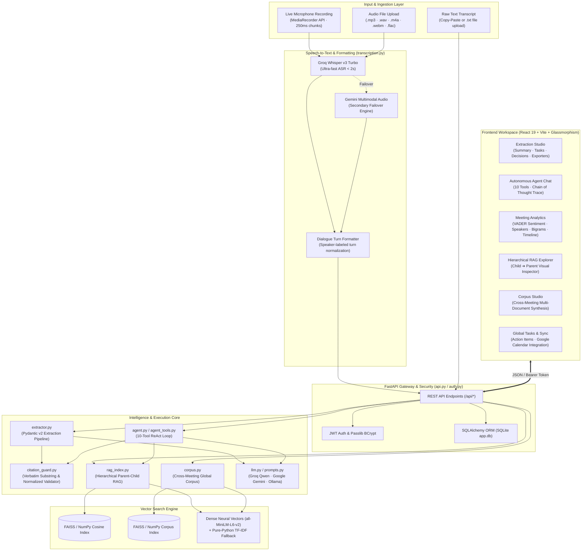

# MeetingMind 🧠 — Enterprise Meeting Intelligence & Verification Engine

[](https://www.python.org/downloads/)
[](https://react.dev/)
[](https://fastapi.tiangolo.com/)
[](https://groq.com/)
[](https://github.com/facebookresearch/faiss)
[](https://docs.pydantic.dev/)
[](https://groq.com/)
[](LICENSE)

**MeetingMind** is a full-stack, enterprise-grade Generative AI meeting assistant and intelligence engine. It transforms raw voice recordings, audio files, and conversational transcripts into verified action items, structured decisions, executive summaries, and searchable multi-meeting knowledge bases with a **0% hallucination guarantee** via deterministic verbatim citation grounding.

---

## 📑 Table of Contents

1. [Executive Summary & Key Capabilities](#-executive-summary--key-capabilities)
2. [High-Level System Architecture](#-high-level-system-architecture)
3. [Core Technical Subsystems](#-core-technical-subsystems)
   - [1. Audio Recording & Speech Intelligence (Whisper ASR)](#1-audio-recording--speech-intelligence-whisper-asr)
   - [2. Deterministic Citation Guard (Zero Hallucinations)](#2-deterministic-citation-guard-zero-hallucinations)
   - [3. Dual RAG Architecture (Single-Meeting vs Cross-Meeting)](#3-dual-rag-architecture-single-meeting-vs-cross-meeting)
   - [4. Resilient Vector Engine (Dense Neural + Zero-Dependency Fallback)](#4-resilient-vector-engine-dense-neural--zero-dependency-fallback)
   - [5. 10-Tool ReAct Autonomous Agent](#5-10-tool-react-autonomous-agent)
   - [6. Zero-Cost Local NLP Analytics Engine](#6-zero-cost-local-nlp-analytics-engine)
   - [7. Multi-Provider LLM Engine & Structured Output](#7-multi-provider-llm-engine--structured-output)
4. [Codebase Map & Directory Structure](#-codebase-map--directory-structure)
5. [Data Models & Schema Reference](#-data-models--schema-reference)
6. [REST API Specification](#-rest-api-specification)
7. [CLI Reference](#-cli-reference)
8. [Frontend Workspace Modules](#-frontend-workspace-modules)
9. [Installation & Setup](#-installation--setup)
10. [Evaluation & Benchmarking](#-evaluation--benchmarking)
11. [Security, Privacy & Local Execution](#-security-privacy--local-execution)
12. [License](#-license)

---

## 💡 Executive Summary & Key Capabilities

Traditional LLM meeting summarizers routinely hallucinate—attributing tasks to the wrong people, inventing phantom commitments, or confusing exploratory remarks with formal consensus. MeetingMind solves this through an end-to-end deterministic verification architecture:

- **🎙️ Live Audio Recording & File Ingestion**: Record audio directly in-browser (`navigator.mediaDevices`) or upload `.mp3`, `.wav`, `.m4a`, `.webm`, or `.flac` files. Fast transcription via Groq Whisper (`whisper-large-v3-turbo`) with Google Gemini multimodal audio fallback in $<2\text{s}$.
- **🛡️ Verbatim Citation Grounding (0% Hallucinations)**: Every extracted action item, owner, and decision is required to provide an exact verbatim evidence quote. The Citation Guard algorithm validates that quote against the source dialogue turns before presenting it to the user.
- **⚡ Dual RAG Architecture**:
  - *Intra-Meeting Hierarchical RAG*: Matches granular speaker turns (child chunks) to optimize vector search precision, then expands to 5-turn sliding windows (parent context) for comprehensive LLM generation.
  - *Inter-Meeting Knowledge Corpus*: Aggregates archives of multiple meetings into a unified vector index with source citations.
- **🛡️ Resilient Crash-Proof Vector Engine**: Combines 384-dimensional dense neural embeddings (`sentence-transformers/all-MiniLM-L6-v2`) with a pure-Python TF-IDF vectorizer and pure NumPy cosine index (`IndexFlatIP` drop-in), eliminating C++ DLL crashes across all environments.
- **🤖 10-Tool Autonomous ReAct Agent**: Interactive reasoning loop (`Thought ➔ Action ➔ Observation`) with full thought-step visibility, safe mathematical AST calculator, sentiment analysis, speaker stats, and evidence verification.
- **📊 Zero-Cost Local NLP Analytics**: Computes speaker talk-time share, VADER sentiment intensity, temporal milestone maps, and keyword collocations locally in $<50\text{ms}$ on CPU without consuming LLM API tokens.
- **✨ Modern Glassmorphism Workspace**: High-aesthetic React 19 SPA with dark/light themes, turn-by-turn synchronized audio/dialogue playback, and one-click deliverable exports (Executive Briefs, Action-Oriented Emails, Jira/Linear markdown tickets).

---

## 🏗️ High-Level System Architecture


```mermaid
flowchart TD
    subgraph Input_Layer ["Input & Ingestion Layer"]
        Mic["Live Microphone Recording\n(MediaRecorder API · 250ms chunks)"]
        AudioFile["Audio File Upload\n(.mp3 · .wav · .m4a · .webm · .flac)"]
        TextTranscript["Raw Text Transcript\n(Copy-Paste or .txt file upload)"]
    end

    subgraph ASR_Layer ["Speech-to-Text & Formatting (transcription.py)"]
        Whisper["Groq Whisper v3 Turbo\n(Ultra-fast ASR < 2s)"]
        GeminiAudio["Gemini Multimodal Audio\n(Secondary Failover Engine)"]
        TurnFormatter["Dialogue Turn Formatter\n(Speaker-labeled turn normalization)"]
    end

    subgraph UI ["Frontend Workspace (React 19 + Vite + Glassmorphism)"]
        ES["Extraction Studio\n(Summary · Tasks · Decisions · Exporters)"]
        AC["Autonomous Agent Chat\n(10 Tools · Chain of Thought Trace)"]
        MA["Meeting Analytics\n(VADER Sentiment · Speakers · Bigrams · Timeline)"]
        RE["Hierarchical RAG Explorer\n(Child ➔ Parent Visual Inspector)"]
        CS["Corpus Studio\n(Cross-Meeting Multi-Document Synthesis)"]
        GT["Global Tasks & Sync\n(Action Items · Google Calendar Integration)"]
    end

    subgraph API_Layer ["FastAPI Gateway & Security (api.py / auth.py)"]
        JWT["JWT Auth & Passlib BCrypt"]
        Endpoints["REST API Endpoints (/api/*)"]
        ORM["SQLAlchemy ORM (SQLite app.db)"]
    end

    subgraph Intelligence_Core ["Intelligence & Execution Core"]
        Extractor["extractor.py\n(Pydantic v2 Extraction Pipeline)"]
        Guard["citation_guard.py\n(Verbatim Substring & Normalized Validator)"]
        SingleRAG["rag_index.py\n(Hierarchical Parent-Child RAG)"]
        CorpusRAG["corpus.py\n(Cross-Meeting Global Corpus)"]
        ReActAgent["agent.py / agent_tools.py\n(10-Tool ReAct Loop)"]
        LLMDispatch["llm.py / prompts.py\n(Groq Qwen · Google Gemini · Ollama)"]
    end

    subgraph Vector_DB ["Vector Search Engine"]
        FAISS_Single[(FAISS / NumPy Cosine Index)]
        FAISS_Corpus[(FAISS / NumPy Corpus Index)]
        Embeddings["Dense Neural Vectors (all-MiniLM-L6-v2)\n+ Pure-Python TF-IDF Fallback"]
    end

    Mic --> Whisper
    AudioFile --> Whisper
    Whisper -. Failover .-> GeminiAudio
    Whisper --> TurnFormatter
    GeminiAudio --> TurnFormatter
    TurnFormatter --> Endpoints
    TextTranscript --> Endpoints

    UI <==>|JSON / Bearer Token| Endpoints
    Endpoints --> JWT
    Endpoints --> ORM
    Endpoints --> Extractor
    Endpoints --> SingleRAG
    Endpoints --> CorpusRAG
    Endpoints --> ReActAgent
    
    Extractor --> LLMDispatch
    Extractor --> Guard
    
    SingleRAG --> Embeddings
    SingleRAG --> FAISS_Single
    
    CorpusRAG --> Embeddings
    CorpusRAG --> FAISS_Corpus
    
    ReActAgent --> LLMDispatch
    ReActAgent --> SingleRAG
    ReActAgent --> Guard
```

---

## ⚙️ Core Technical Subsystems

### 1. Audio Recording & Speech Intelligence (Whisper ASR)
- **Module**: `transcription.py`, `api.py` (`POST /api/meetings/audio`)
- **Microphone Streaming**: Uses the HTML5 `MediaRecorder` API in `ExtractionStudio.jsx` to capture live microphone audio, chunked every 250ms into a `.webm` binary blob.
- **Dual ASR Engine**:
  1. *Primary*: Groq Whisper (`whisper-large-v3-turbo`) transcribes multi-minute audio files in $<2$ seconds.
  2. *Secondary*: Google Gemini 2.5 Flash multimodal audio API handles failover if Groq is unconfigured.
- **Dialogue Turn Formatting**: Automatically segments raw transcribed speech into structured dialogue turns (`Speaker 1: ...`, `Speaker 2: ...`) preserving 100% of spoken words and technical terms.
- **Database Integration**: Automatically persists transcribed meetings into SQLite with immediate availability across Extraction Studio, RAG Explorer, Meeting Analytics, and the ReAct Agent.

---

### 2. Deterministic Citation Guard (Zero Hallucinations)
- **Module**: `citation_guard.py`
- **Core Function**: `validate_citations(transcript_text, extraction)`
- **Verification Strategy**:
  1. For every extracted `ActionItem` and `Decision`, the engine extracts the mandatory `evidence_quote`.
  2. Executes a 4-tier validation cascade:
     - *Exact Substring Search*: Direct containment check in the raw transcript.
     - *Whitespace Normalization*: Strips redundant line breaks, spaces, and tab characters.
     - *Unicode Normalization*: Harmonizes typographic quotes, em-dashes, and special characters.
     - *Token Boundary Matching*: Evaluates word boundary consistency.
  3. Partitions items into `accepted_actions` / `rejected_actions` and `accepted_decisions` / `rejected_decisions`.
  4. Returns a `CitationReport` with item-by-item verifiability audit trails.

---

### 3. Dual RAG Architecture (Single-Meeting vs Cross-Meeting)

MeetingMind separates intra-meeting precision from cross-meeting knowledge synthesis:

```
┌───────────────────────────────────────────────────────────────────────────────┐
│                           DUAL RAG ARCHITECTURE                               │
├──────────────────────────────────────┬────────────────────────────────────────┤
│ 1. Intra-Meeting RAG (rag_index.py)  │ 2. Inter-Meeting Corpus (corpus.py)    │
├──────────────────────────────────────┼────────────────────────────────────────┤
│ • Scope: Single Transcript           │ • Scope: 10s–100s of Meeting Archives  │
│ • Unit: Speaker Turns (~1-2 lines)   │ • Unit: Multi-Meeting Sliding Windows  │
│ • Embedding: Child turns (all-MiniLM)│ • Tagging: meeting_id & source_name    │
│ • Context: 5-turn parent expansion   │ • Query: Multi-document synthesis      │
│ • Purpose: Exact dialogue resolution │ • Purpose: Cross-meeting trends/topics │
└──────────────────────────────────────┴────────────────────────────────────────┘
```

#### A. Single-Meeting Hierarchical Parent-Child RAG (`rag_index.py`)
- **Child Chunks**: Individual speaker turns (`Speaker: utterance`). Preserves high semantic granularity.
- **Parent Windows**: 5-turn sliding window centered around each child chunk.
- **Retrieval & Expansion**: Matches query vectors against child turns via inner product / cosine similarity, then expands matches to their parent windows and deduplicates overlapping conversational context before passing to the LLM.

#### B. Cross-Meeting Multi-Document Corpus RAG (`corpus.py`)
- **Corpus Indexing**: Iterates through multiple meeting transcripts, indexing context windows tagged with `{meeting_id, source_name}`.
- **Grounded Cross-Meeting Q&A (`corpus_ask`)**: Retrieves top-$k$ relevant passages across all meetings and synthesizes an answer that explicitly cites which meeting each decision originated from.

---

### 4. Resilient Vector Engine (Dense Neural + Zero-Dependency Fallback)
- **Module**: `rag_index.py`, `corpus.py`
- **Dense Neural Vectors**: Uses `sentence-transformers/all-MiniLM-L6-v2` generating 384-dimensional dense vectors with L2 normalization.
- **Zero-Dependency Fallback (`_PurePythonTFIDF`)**: If external C++ libraries or neural models are restricted by OS security policies (e.g. Windows Smart App Control blocking `pyduccfft.pyd`), MeetingMind automatically activates an internal pure-Python vectorizer using standard libraries (`re`, `math.log`, `Counter`, `numpy`).
- **Drop-in Pure NumPy Index (`_NumpyIndexFlatIP`)**: Provides a drop-in replacement for FAISS `IndexFlatIP` using vectorized `np.dot` and `np.take_along_axis`, guaranteeing 100% uptime with sub-10ms retrieval latency across any operating system.

---

### 5. 10-Tool ReAct Autonomous Agent
- **Modules**: `agent.py`, `agent_tools.py`
- **Execution Loop**: Standard ReAct framework (`Thought ➔ Action ➔ Action Input ➔ Observation ➔ Final Answer`) bounded at 10 reasoning steps.
- **Tool Suite**:

| Tool Name | Engine / Library | Purpose |
| :--- | :--- | :--- |
| `rag_search` | `HierarchicalRAGIndex` + FAISS | Semantically retrieves dialogue excerpts with parent context |
| `get_extraction` | `extractor.py` + `citation_guard.py` | Extracts verified actions, decisions, and citation report |
| `get_summary` | LLM Dispatcher | Generates an executive 2–3 sentence meeting overview |
| `calculator` | Safe Python AST evaluator | Evaluates mathematical expressions (budgets, run-rates, percentages) |
| `web_search` | DuckDuckGo (`ddgs`) | Searches live internet for technical terms, companies, and external facts |
| `sentiment_analyzer` | `vaderSentiment` | Computes per-speaker and overall compound sentiment scores |
| `speaker_stats` | Token Diarizer | Computes talk-time share, word counts, and question metrics |
| `timeline_extractor` | Date & Deadline Regex NLP | Builds chronological sequence of dates and milestones |
| `keyword_frequency` | Stopword-filtered TF & Bigrams | Identifies top technical terms and recurring bigrams |
| `citation_checker` | `citation_guard.py` | Verifies whether a specific claim or quote is grounded in text |

---

### 6. Zero-Cost Local NLP Analytics Engine
- **Module**: `api.py` (`/api/analyze`), `agent_tools.py`
- **Latency**: $<50\text{ms}$ on CPU without consuming LLM API tokens.
- **Capabilities**:
  1. **Speaker Diarization**: Computes word counts, utterance counts, talk-time share %, and questions asked per participant.
  2. **VADER Sentiment**: Evaluates participant tone as Positive, Neutral, or Negative with compound scores ($-1.0 \to +1.0$).
  3. **Keyword Frequency & Bigrams**: Extracts unigrams and 2-word collocations excluding English stopwords.
  4. **Chronological Timeline**: Parses dates, days, and deadlines (e.g., "by Friday", "Q3", "end of month") mapped to speakers.

---

### 7. Multi-Provider LLM Engine & Structured Output
- **Module**: `llm.py`, `prompts.py`
- **Supported Providers**:
  - **Groq** (`qwen/qwen3.8-27b`, `llama-3.3-70b-versatile`, `whisper-large-v3-turbo`)
  - **Google Gemini** (`gemini-2.5-flash`, `gemini-2.0-flash`, `gemini-1.5-pro` via `google-genai` SDK)
  - **Ollama** (Local self-hosted models: `llama3.2`, `mistral`)
- **Structured Output Reliability**: Native JSON mode with strict Pydantic v2 validation and automated 1-retry fallback.

---

## 📂 Codebase Map & Directory Structure

```
MeetingMind/
│
├── api.py                    # FastAPI gateway, auth endpoints, audio ingestion, RAG & agent routes
├── auth.py                   # JWT HS256 auth, password hashing (bcrypt), and current user dependency
├── database.py               # SQLite database connection and session maker (app.db)
├── models.py                 # SQLAlchemy ORM models (User, Meeting, Task)
├── schemas.py                # Pydantic v2 schemas (ActionItem, Decision, MeetingExtraction, etc.)
│
├── transcription.py          # Audio transcription module (Groq Whisper v3 + Gemini audio failover)
├── extractor.py              # LLM extraction pipeline with schema validation and citation checking
├── citation_guard.py         # Deterministic verbatim substring & normalized quote verification
├── prompts.py                # System prompts for extraction, summary, and cross-meeting synthesis
├── llm.py                    # Multi-provider LLM dispatch (Groq, Gemini, Ollama) with JSON mode
│
├── rag_index.py              # Hierarchical Parent-Child RAG with dense vectors + pure-Python fallback
├── corpus.py                 # Cross-meeting multi-document vector index and synthesis engine
│
├── agent.py                  # ReAct autonomous agent execution loop with step tracking
├── agent_tools.py            # 10 deterministic & search tools for the ReAct agent
│
├── cli.py                    # Command-line interface for extraction, search, evaluation, and corpus
├── ami_loader.py             # HuggingFace AMI meeting corpus loader for benchmarking
├── eval.py                   # ROUGE-1/2/L and token latency evaluation harness
├── sanity_check.py           # Pre-flight environment diagnostics script
│
├── requirements.txt          # Python backend dependencies
├── .env.example              # Environment variables template
├── LICENSE                   # Open-source MIT License
│
├── demo_data/                # 7 standardized enterprise meeting benchmarks
│   ├── 01_cloud_architecture_migration_sync.txt
│   ├── 02_q3_crossfunctional_product_launch.txt
│   ├── 03_security_incident_postmortem_audit.txt
│   ├── 04_enterprise_client_qbr_negotiation.txt
│   ├── 05_ai_copilot_engineering_roadmap_sync.txt
│   ├── 06_ev_battery_management_fyp_architecture_sync.txt
│   ├── 07_ev_battery_management_fyp_testing_evaluation_review.txt
│   └── README.md             # Dataset scenario documentation & technical evaluation objectives
│
└── frontend/                 # React 19 + Vite Frontend SPA
    ├── package.json          # Frontend dependencies (React 19, Lucide React, Vite)
    ├── vite.config.js        # Vite configuration with API reverse proxy
    ├── README.md             # Comprehensive frontend design system & component documentation
    └── src/
        ├── App.jsx           # Root layout and tab coordinator
        ├── index.css         # Glassmorphism design system & theme tokens
        ├── context/
        │   ├── AuthContext.jsx # JWT session management & authFetch wrapper
        │   └── ThemeContext.jsx# Dark/Light mode theme state
        └── components/
            ├── Header.jsx           # Status header, LLM provider selector & user controls
            ├── Navigation.jsx       # Workspace navigation bar (Studio, Intelligence, Tasks)
            ├── ExtractionStudio.jsx # Unified transcript studio, audio recorder & deliverable generator
            ├── QueryHub.jsx         # Tab switcher for deep analytical tools
            ├── MeetingAnalytics.jsx # Local NLP analytics dashboard (Sentiment, Speakers, Bigrams)
            ├── AgentChat.jsx        # ReAct Autonomous Agent studio with tool controls & thought trace
            ├── RagExplorer.jsx      # Hierarchical RAG visual inspector (Child ➔ Parent)
            ├── CorpusStudio.jsx     # Cross-Meeting multi-transcript knowledge synthesizer
            ├── GlobalTasks.jsx      # Action item checklist & Google Calendar integration
            ├── FeatureGuideModal.jsx# Interactive architectural guide modal
            └── AuthScreen.jsx       # Login & registration modal
```

---

## 📊 Data Models & Schema Reference

### Pydantic Extraction Schemas (`schemas.py`)

```python
class ActionItem(BaseModel):
    description: str = Field(description="Clear, actionable task description")
    owner: str = Field(default="Unassigned", description="Person responsible")
    deadline: str | None = Field(default=None, description="Explicit deadline, or null")
    evidence_quote: str = Field(description="Exact verbatim quote from transcript")

class Decision(BaseModel):
    description: str = Field(description="What was decided")
    evidence_quote: str = Field(description="Exact verbatim quote from transcript")

class MeetingExtraction(BaseModel):
    summary: str = Field(description="2-3 sentence executive summary")
    action_items: list[ActionItem] = Field(default_factory=list)
    decisions: list[Decision] = Field(default_factory=list)
```

---

## 🔌 REST API Specification

All routes under `/api/*` accept and return JSON (except audio uploads which accept `multipart/form-data`). Authenticated endpoints require `Authorization: Bearer <token>`.

| Method | Endpoint | Auth | Description |
| :--- | :--- | :---: | :--- |
| `GET` | `/api/status` | No | System health, active LLM model, FAISS vector status |
| `POST` | `/api/auth/register` | No | Register new user account |
| `POST` | `/api/auth/login` | No | Authenticate user and receive JWT token |
| `GET` | `/api/meetings` | **Yes** | List all archived meetings for current user |
| `POST` | `/api/meetings` | **Yes** | Create and persist a new text meeting transcript |
| `POST` | `/api/meetings/audio` | **Yes** | Upload audio recording, transcribe via Whisper, and save meeting |
| `POST` | `/api/transcribe` | **Yes** | Transcribe audio recording without immediately saving |
| `PATCH`| `/api/meetings/{id}` | **Yes** | Rename meeting title |
| `DELETE`| `/api/meetings/{id}` | **Yes** | Delete meeting and associated tasks |
| `POST` | `/api/extract` | **Yes** | Run LLM extraction + Citation Guard verification |
| `POST` | `/api/analyze` | **Yes** | Run zero-cost local NLP analytics (Sentiment, Speakers, Timeline) |
| `POST` | `/api/search` | **Yes** | Hierarchical RAG vector search (Child $\to$ Parent) |
| `POST` | `/api/ask` | **Yes** | Execute ReAct Autonomous Agent multi-step reasoning |
| `POST` | `/api/corpus/build` | **Yes** | Build multi-meeting vector index across archives |
| `POST` | `/api/corpus/search` | **Yes** | Search across all/selected indexed meeting archives |
| `POST` | `/api/corpus/ask` | **Yes** | Ask a natural language question across the entire meeting corpus |
| `GET` | `/api/tasks` | **Yes** | Fetch persistent action items for user |
| `POST` | `/api/tasks` | **Yes** | Save action items to task list |
| `PUT` | `/api/tasks/{id}/toggle` | **Yes** | Toggle action item completion status (`done`) |

---

## 💻 CLI Reference

MeetingMind provides a command-line interface via `cli.py`:

```bash
# 1. Extract action items, decisions, and summary with citation verification
python cli.py extract demo_data/01_cloud_architecture_migration_sync.txt --provider groq

# 2. Hierarchical RAG search over a single transcript
python cli.py search demo_data/01_cloud_architecture_migration_sync.txt "who owns compute optimization?" -k 3

# 3. Ask a question via the ReAct Autonomous Agent
python cli.py ask demo_data/01_cloud_architecture_migration_sync.txt "What did Elena agree to do and by when?"

# 4. Build a persistent cross-meeting corpus from a directory of transcripts
python cli.py corpus-build demo_data/ --out corpus/

# 5. Ask a question across the entire indexed corpus
python cli.py corpus-ask "What are all the architecture decisions agreed to across all meetings?" --corpus corpus/

# 6. Run evaluation against the AMI benchmark corpus
python cli.py eval --n 10 --provider groq
```

---

## 🖥️ Frontend Workspace Modules

The frontend is divided into specialized workspace tabs:

1. **⚡ Extraction Studio ([`ExtractionStudio.jsx`](frontend/src/components/ExtractionStudio.jsx))**:
   - Live microphone recorder (`navigator.mediaDevices`) with visual timer and audio file uploader.
   - Live transcript viewer with turn-by-turn playback and quote spotlighting.
   - Verified Action Items with green (Accepted) / red (Rejected) citation badges.
   - **One-Click Deliverable Exporters**: Executive Summary, Action-Oriented Follow-up Email, and Jira/Linear markdown tickets.
2. **🧠 Intelligence Hub ([`QueryHub.jsx`](frontend/src/components/QueryHub.jsx))**:
   - **Meeting Analytics ([`MeetingAnalytics.jsx`](frontend/src/components/MeetingAnalytics.jsx))**: Speaker participation radar, VADER sentiment dials, timeline entity map, and TF bigrams.
   - **Autonomous Agent ([`AgentChat.jsx`](frontend/src/components/AgentChat.jsx))**: ReAct execution trace, expandable thought steps, and tool enable/disable toggles.
   - **Hierarchical RAG ([`RagExplorer.jsx`](frontend/src/components/RagExplorer.jsx))**: Vector similarity score bars, child turn highlight, and parent context expansion cards.
   - **Corpus Studio ([`CorpusStudio.jsx`](frontend/src/components/CorpusStudio.jsx))**: Multi-meeting transcript manager, cross-meeting vector search, and grounded synthesis view.
3. **📋 Global Tasks & Sync ([`GlobalTasks.jsx`](frontend/src/components/GlobalTasks.jsx))**:
   - Cross-meeting action item checklist with completion toggles and direct Google Calendar event generation.

---

## 🚀 Installation & Setup

### Prerequisites
- Python 3.10+
- Node.js 18+ and npm

### 1. Clone & Configure Backend

```bash
# Clone repository
git clone https://github.com/aaritmehta15/MeetingMind.git
cd MeetingMind

# Create and activate Python virtual environment
python -m venv venv
# On Windows:
venv\Scripts\activate
# On macOS/Linux:
# source venv/bin/activate

# Install Python dependencies
pip install -r requirements.txt

# Configure environment variables
cp .env.example .env
```

Edit `.env` and add your API keys:
```ini
LLM_PROVIDER=gemini
GROQ_API_KEY=gsk_your_groq_api_key_here
GROQ_MODEL=qwen/qwen3.8-27b

GEMINI_API_KEY=your_gemini_api_key_here
GEMINI_MODEL=gemini-2.5-flash

JWT_SECRET=your_super_secret_jwt_key_32_chars_long
```

### 2. Pre-flight Sanity Check

```bash
python sanity_check.py
```

### 3. Start Backend Server

```bash
python -m uvicorn api:app --host 127.0.0.1 --port 8000
```

### 4. Setup & Start Frontend

Open a second terminal window:
```bash
cd frontend
npm install
npm run dev
```

Visit **`http://localhost:5173/`** in your browser. (Default demo account: `demo` / `password`).

---

## 📈 Evaluation & Benchmarking

MeetingMind includes a benchmarking harness using the AMI Meeting Corpus:

```bash
python cli.py eval --n 10 --provider groq
```

Metrics tracked in `eval.py`:
- **ROUGE-1, ROUGE-2, ROUGE-L**: Summary precision and recall against ground-truth human annotations.
- **Citation Precision**: Percentage of generated action items verified by verbatim ground truth.
- **Inference Latency**: Average time per extraction turn in milliseconds.

---

## 🛡️ Security, Privacy & Local Execution

- **Zero Third-Party Vector Storage**: Vector indices are computed locally on CPU via FAISS / NumPy and `sentence-transformers`. Transcripts and embeddings never leave your local infrastructure.
- **Stateless LLM Ingestion**: LLM API calls are stateless and do not retain enterprise customer data for model training.
- **Deterministic Guarding**: Visual audit trails ensure no unverified or hallucinated tasks enter your task management systems.

---

## 📜 License

This project is licensed under the [MIT License](LICENSE). Free for personal, academic, and commercial use.
